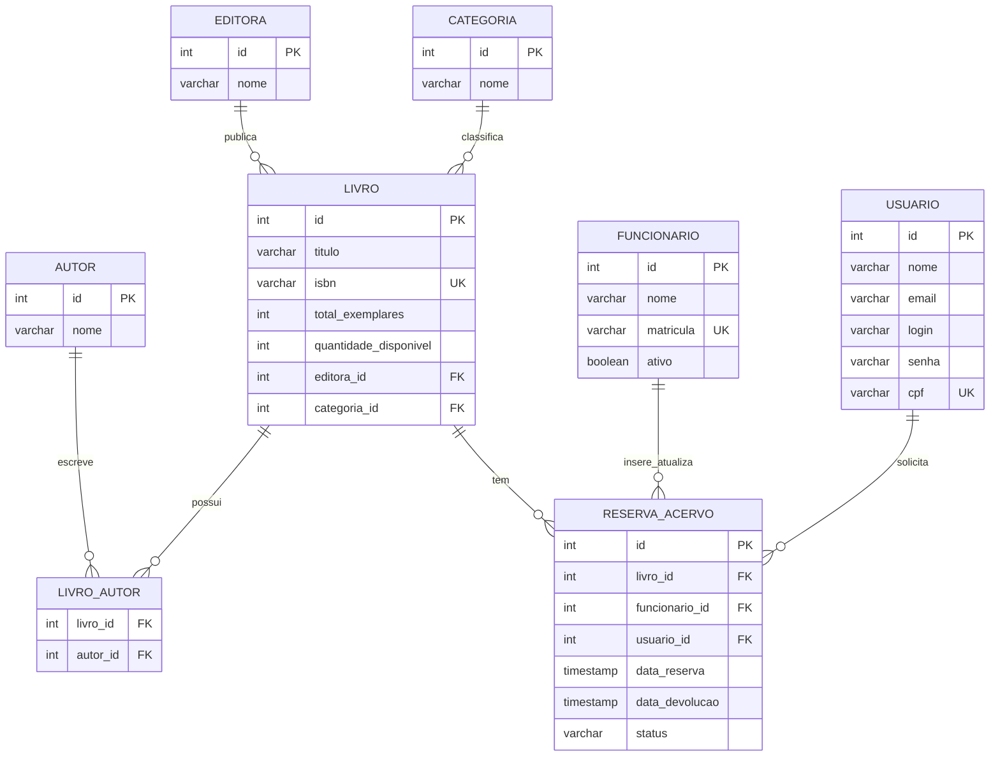

# Acervo CLI - Sistema de Gerenciamento de Biblioteca Acadêmica

Projeto final avaliativo desenvolvido para o Módulo 01 de Back End Node. Este é um sistema de linha de comando (CLI) construído com Node.js, TypeScript e PostgreSQL, focado em princípios de Clean Architecture, injeção de dependências e acesso seguro a dados.

---

## Links Importantes

*   **Repositório (Fork):** [GeorgeGraciosa/biblioteca](https://github.com/GeorgeGraciosa/biblioteca)

---

## Arquitetura e Padrões Aplicados

Para evitar um código monolítico, o sistema foi organizado em camadas com responsabilidades estritas, garantindo que a borda de I/O (Terminal e Banco de Dados) não se misture com as regras de negócio:

*   **Views (CLI):** Responsáveis exclusivamente pela interação com o usuário (ex: `MainView`).
*   **Use Cases (Services):** Contêm as regras de negócio da aplicação (ex: `DevolucaoUseCase`, `ReservaUseCase`).
*   **Repositories:** Camada isolada para interação com o banco de dados via queries parametrizadas (ex: `LivroRepository`).
*   **Injeção de Dependência (Bônus B08):** As dependências são injetadas via construtor (ex: as Views recebem os UseCases, que recebem os Repositories), facilitando a manutenção e os testes. Instanciação controlada a partir do `main.ts`.

---

## Modelagem do Banco de Dados

O banco de dados foi modelado respeitando as entidades fundamentais do domínio bibliotecário. 



---

## Instalação e Configuração

**Pré-requisitos:**
*   Node.js instalado.
*   PostgreSQL rodando localmente ou em contêiner.

**1. Clonando o repositório**
```bash
git clone git@github.com:GeorgeGraciosa/biblioteca.git
```
2. Instalando as dependências
```
npm install
```
3. Configurando as Variáveis de Ambiente
Crie um arquivo .env na raiz do projeto, utilizando o .env.example como base:
```
DB_USER=seu_usuario_postgres
DB_PASSWORD=sua_senha
DB_HOST=localhost
DB_PORT=5432
DB_NAME=acervo
```
4. Configurando o Banco de Dados
A criação das tabelas e a carga inicial de dados são reprodutíveis. Execute os scripts SQL:
- Execute o arquivo `db/init.sql` para gerar o esquema.
- Execute o arquivo `db/seed.sql` para popular as tabelas (inclui os livros: One Piece, Lord of the Rings e Harry Potter).

---

## Execução
Para iniciar a interface de linha de comando (CLI), rode:
```
npm run dev
```
